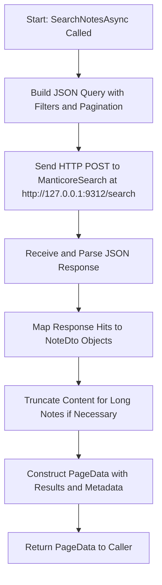

# Plan to Reimplement `SearchNotesAsync` with ManticoreSearch HTTP-JSON Protocol

## Objective
Reimplement the `SearchNotesAsync` method in `SearchService.cs` to use ManticoreSearch's HTTP-JSON protocol instead of direct SQL queries, ensuring the search functionality remains consistent with the current implementation regarding filtering, pagination, and result formatting.

## Background
- Current implementation uses SQL-like queries via `SqlSugarClient` to interact with ManticoreSearch through a MySQL connection on port 9306.
- ManticoreSearch configuration (`manticore.development.conf`) indicates an HTTP endpoint is available on port 9312.
- No existing code in the project uses the HTTP-JSON protocol for ManticoreSearch interactions.

## Steps to Implement

1. **Setup HTTP Client for ManticoreSearch**
   - Create or configure an `HttpClient` instance in `SearchService` to communicate with ManticoreSearch at `http://127.0.0.1:9312`.
   - Ensure the client is properly initialized, possibly as a dependency injected via constructor, to handle HTTP requests. This might involve adding a new service or configuration in `ServiceExtensions.cs`.

2. **Construct JSON Query for Search**
   - Develop a method to build a JSON payload for the search request that mirrors the current SQL query logic:
     - Match the query string against the content.
     - Filter by `UserId` and `DeletedAt` based on the `NoteFilterType` (Normal or Deleted).
     - Apply pagination using `offset` and `limit` parameters.
     - Sort results by `CreatedAt` in descending order.
   - Reference ManticoreSearch documentation for the correct JSON structure, likely using the `/search` endpoint with a query object.

3. **Send HTTP Request and Handle Response**
   - Use the `HttpClient` to send a POST request to `http://127.0.0.1:9312/search` with the JSON payload.
   - Parse the JSON response from ManticoreSearch, extracting the total count of matches and the list of hits (notes).
   - Map the response data to `NoteDto` objects, ensuring fields like `Id`, `UserId`, `Content`, etc., are correctly populated.

4. **Handle Content Truncation for Long Notes**
   - Maintain the existing logic to truncate content for notes where `IsLong` is true, limiting the content to 1024 characters using the `GetShort()` method.

5. **Implement Pagination and Return Results**
   - Construct a `PageData<NoteDto>` object with the retrieved list of notes, total count, current page index, and page size, mirroring the current implementation's output format.

6. **Update Other Methods if Necessary**
   - Assess if other methods in `SearchService` (`SyncNoteToIndexAsync`, `DeleteNoteFromIndexAsync`, etc.) also need to be updated to use HTTP-JSON protocol for consistency. Plan to address these in subsequent steps if required, though the primary focus is `SearchNotesAsync`.

7. **Testing and Validation**
   - After implementation, test the new search functionality to ensure it returns the same results as the current SQL-based method for identical queries and filters.
   - Validate pagination, sorting, and content truncation behaviors.

## Mermaid Diagram for Implementation Flow

## Considerations
- **Error Handling**: Ensure robust error handling for HTTP request failures or malformed responses from ManticoreSearch.
- **Performance**: Compare the performance of HTTP-JSON requests versus the current SQL approach to ensure no significant degradation.
- **Configuration**: Make the HTTP endpoint configurable (e.g., via `appsettings.json`) to support different environments or setups.
- **Dependencies**: Add necessary NuGet packages if additional libraries are required for JSON serialization or HTTP client management (though .NET's built-in `HttpClient` and `System.Text.Json` should suffice).